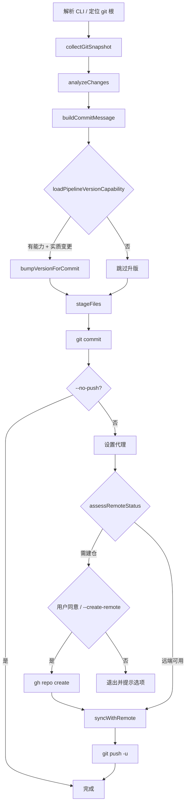

# commit-push

Cursor Agent Skill：将「提交推送」固化为可重复流程，在**任意 git 仓库**上一键完成变更分析、可选升版、commit 与 push。

Agent 操作指南见 [SKILL.md](./SKILL.md)；本文档梳理 skill 的完整功能与实现约定。

---

## 安装

在本 skill 目录执行：

```bash
node install.mjs
```

脚本会自动检测本机已存在的 Agent 配置目录，并把当前 skill 安装到对应位置：

| Agent | 检测目录 | 安装位置 |
| --- | --- | --- |
| Cursor | `~/.cursor` | `~/.cursor/skills/commit-push` |
| Codex | `~/.codex` | `~/.codex/skills/commit-push` |
| Claude Code | `~/.claude` | `~/.claude/skills/commit-push` |

默认安装方式是创建链接，也就是这些目录会指向当前源码目录。这样电脑上只保留一份 `commit-push` 代码，后续修改本目录会自动对各 Agent 生效。

不存在的 Agent 配置目录会自动跳过。跨 OS 可用（macOS / Linux / Windows）。

可先预览：

```bash
node install.mjs --dry-run
```

安装到所有已知目录，即使没有检测到对应工具：

```bash
node install.mjs --all
```

只安装到某个工具：

```bash
node install.mjs --only cursor
node install.mjs --only codex
node install.mjs --only claude
```

使用复制方式安装，而不是链接：

```bash
node install.mjs --copy
```

`--copy` 适合不允许创建 symlink 的系统或环境。复制安装后，如果修改本目录，需要重新运行安装脚本同步到各 Agent。

---

## 定位

| 角色 | 职责 |
| --- | --- |
| **Agent（对话）** | 从上下文归纳「为什么改」，写入 `--intent` 或 `-m` |
| **commit_push.cjs（脚本）** | 采集 git 事实、生成/组装 commit message、stage、可选升版、commit、push |
| **目标 git 仓库** | 脚本运行所在仓库（`cwd` 向上找 `.git`，或 `--cwd=` 指定） |

脚本**不硬编码项目名**：在哪个仓库根执行，就对哪个仓库提交与推送；升版检测同样只针对该仓库。

**多仓库**：Agent 从对话收集修改文件，用 `--file` 传入；脚本自动分组并在每个 git 根**分别** commit/push。

---

## 功能一览

### 0. 多仓库按文件分组（`--file` / `--files`）

当对话中的改动跨越多个 git 仓库时：

1. Agent 列出本次修改的**绝对或相对路径**
2. 脚本对每个路径 `findGitRoot`，合并为 `{ repoRoot → scopePaths[] }`
3. 各仓库独立：采集 → 范围过滤 → 升版 → stage → commit → push

未传文件列表时，行为与原先相同（单仓 `--cwd` 全量提交）。

---

并行读取当前仓库状态，对齐 Agent 手工排查时的信息面：

- `git status --porcelain` — 工作区与暂存区概览
- `git diff --stat` / `git diff --cached --stat` — 变更规模
- `git diff --name-status HEAD` — 增删改文件列表
- `git ls-files --others --exclude-standard` — 未跟踪且未被 ignore 的文件
- `git log -5 --oneline` — 近期 commit 风格参考

输出合并为统一的 `nameStatus` 列表（A/M/D/R），供后续分析与 staging 使用。

### 2. 变更分析

对采集结果做结构化摘要：

- **目录聚类**：按顶层目录统计变更文件数（如 `scripts(12)`、`docs(3)`）
- **启发式标签**：`documentation`、`scripts/tests`、`rename/refactor`、`spec/templates`、`initial or bulk add` 等
- **Conventional 前缀推断**：无 `--intent` 时辅助生成 `docs:` / `refactor:` / `test:` / `chore:` 类 subject
- **Diff 摘录**：最多 3 个文件、每文件 8 行，写入 commit body

### 3. Commit Message 生成

优先级（高 → 低）：

1. `-m=` / `--message=` — 用户或 Agent 指定完整消息
2. `--intent=` — 对话归纳的「修改目的」，作为 subject（最长 72 字符）
3. 启发式 — 按目录聚类与标签自动生成 subject + body

Body 包含：变更文件数、主要目录、启发式标签、增删改计数、近期 commit、diff 摘录（最多 24 行）。

### 4. 密钥与安全拦截

stage 前自动排除疑似敏感路径（`.template` 后缀除外）：

| 匹配规则 | 示例 |
| --- | --- |
| `config.env` | 本地环境配置 |
| `/.env`、`.env.` | 环境变量文件 |
| `credentials` | 凭据相关路径 |
| `.pem`、`.key` | 密钥文件 |

无变更时不创建空提交；禁止修改 `git config`；禁止对 `main`/`master` 使用 `git push --force`（除非用户明确要求）。

### 5. Stage 与 Commit

- 默认 `git add -A`（尊重 `.gitignore`）
- 可用 `--no-add-all` 或传入具体路径，只 stage 指定文件
- 升版产生的 `VERSION`、`CHANGELOG.md` 等会在 commit 前额外 `git add`
- 非交互环境须加 `--yes` 跳过「继续? [y/N]」

### 6. 推送与远端同步

推送前流程：

```
git fetch <remote>
  ↓ 远端领先？
git pull --no-rebase <remote> <branch>   ← 有冲突则退出，需人工解决
  ↓
git push -u <remote> <branch>
```

| 行为 | 说明 |
| --- | --- |
| 默认 remote | `origin`（可用 `--remote=` 覆盖） |
| 默认 branch | 当前分支（可用 `--branch=` 覆盖） |
| fetch 失败 | 打印警告后继续 push（常见于首次推送、远端分支尚不存在） |
| `--no-push` | 只 commit，不 push |

### 7. 代理

推送时自动设置 HTTP 代理，避免每次手动 `export`：

- 默认：`http://127.0.0.1:1087`
- 环境已有 `http_proxy` / `https_proxy` 时优先使用环境变量
- `--proxy=<url>` 覆盖默认值
- `--no-proxy` 关闭代理（内网 / 本地 remote）

### 8. 可选自动升版

**不绑定任何特定项目。** 脚本按以下顺序检测升版能力：

1. 优先使用 `**/scripts/libs/pipeline-version.cjs`
2. 该模块需导出 `readPipelineVersion`、`bumpVersion`、`recordCommitPushVersionBump`
3. 若没有 pipeline 模块，则从本次变更路径向上查找同时包含 `SKILL.md` 和 `VERSION` 的 skill 目录

两类能力都不存在 → **跳过升版**，仅做普通 commit/push。

#### 升版触发条件

本次变更中有**实质内容**（非仅版本元数据文件）：

- `VERSION`
- `CHANGELOG.md`
- `package.json`
- `pipeline-manifest.json`

通用 skill fallback 仅维护 `VERSION` 与 `CHANGELOG.md`；pipeline 模式会继续同步 `package.json`、`pipeline-manifest.json`（若存在）。

#### 升版动作（`git add` 之前）

1. `VERSION` patch +1，同步 `package.json`、`pipeline-manifest.json`（pipeline 模式且文件存在时）
2. 向 `CHANGELOG.md` 前插条目（标题 = commit subject，正文 = commit body 要点）
3. 将版本相关文件一并纳入本次 commit

#### 路径过滤

优先使用 `pipeline-version.cjs` 导出的：

- `isSkillRepoPath`（或 `isPifSkillRepoPath`、`isStd4SkillRepoPath` 等兼容别名）
- `isVersionMetaOnlyPath`（或对应别名）

未导出时使用通用回退：按 `skillPrefix` 判断路径归属，元数据文件名匹配上述四文件。

`--dry-run` 仅预览升版区间（如 `0.1.9 → 0.1.10`），不写磁盘。

### 9. 远端不存在时可选自动建仓

推送前检测 **当前 git 仓库** 的 GitHub 远端（`scripts/github_remote.cjs`）：

| 状态 | 含义 |
| --- | --- |
| `ok` | remote 已配置且 GitHub 仓库存在 |
| `no_remote` | 未配置 `origin`（等） |
| `repo_not_found` | remote URL 指向不存在的 GitHub 仓库 |
| `gh_unavailable` / `gh_not_authenticated` | 无法调用 `gh` 自动建仓 |

不可用时脚本**打印可选操作**，不会静默失败：

1. **自动建仓** — `gh repo create <owner>/<repo> --private`（默认 private），配置 remote 后继续 push
2. **手动配置** — 自行 `git remote add/set-url`
3. **仅提交** — `--no-push`

**用户同意建仓时：**

| 场景 | 用法 |
| --- | --- |
| 交互终端 | 脚本询问 `[y/N]`，确认后建仓并推送 |
| Agent / CI | `--create-remote --yes`（须对话中已获用户同意） |

仓库名默认取目录名 slug（如 `piflow`）；可用 `--github-repo=`、`--github-owner=` 覆盖。公开仓加 `--github-public`。

要求：GitHub remote、`gh` 已安装且 `gh auth login`。非 GitHub 托管地址不会自动建仓。

### 10. 操作报告（执行完成后）

每次运行结束（含 `--dry-run`）输出 **`commit_push 操作报告`**，汇总：

| 区块 | 内容 |
| --- | --- |
| 已跳过路径 | 不存在 / 无 git / 密钥拦截 |
| 无变更仓库 | 范围内无 diff 的仓 |
| 各仓库明细 | 分支、范围、逐步动作、暂存文件、commit 哈希、升版、远端建仓、推送结果 |
| 页脚统计 | 成功/失败/预览提示 |

Agent 应基于该报告向用户复述操作结果，而非省略细节。

---

## 执行流程



---

## CLI 参考

```bash
node ~/.cursor/skills/commit-push/scripts/commit_push.cjs [选项]
```

| 选项 | 说明 |
| --- | --- |
| `--intent=<text>` | 修改目的（推荐；Agent 从对话归纳） |
| `-m=` / `--message=` | 完整 commit message（subject + 可选 body） |
| `--cwd=<path>` | 指定 git 仓库根 |
| `--dry-run` | 仅输出分析报告，不写 git |
| `--json-report` | 输出 JSON 结构化报告，不执行 git |
| `--yes` / `-y` | 跳过交互确认（Agent 必加） |
| `--no-push` | 只提交，不推送 |
| `--no-proxy` | 推送不使用代理 |
| `--proxy=<url>` | 覆盖默认代理 |
| `--remote=<name>` | 远程名，默认 `origin` |
| `--branch=<name>` | 分支名，默认当前分支 |
| `--no-add-all` | 不全量 add，仅 stage 分析出的变更路径 |
| `--file=<path>` | 修改文件（可重复）；多仓库自动分组 |
| `--files=a,b,c` | 逗号分隔修改文件 |
| `--create-remote` | 远端缺失时自动 `gh repo create`（须用户同意；Agent 配合 `--yes`） |
| `--github-public` | 建仓为 public（默认 private） |
| `--github-visibility=private\|public` | 显式指定可见性 |
| `--github-owner=<user\|org>` | 建仓 owner |
| `--github-repo=<name>` | 建仓仓库名 |
| `-h` / `--help` | 打印用法摘要 |

### 典型用法

```bash
# 预览（推荐第一步）
node ~/.cursor/skills/commit-push/scripts/commit_push.cjs \
  --cwd=/path/to/repo \
  --intent="对齐 recovery 与文档" \
  --dry-run

# 正式提交并推送
node ~/.cursor/skills/commit-push/scripts/commit_push.cjs \
  --cwd=/path/to/repo \
  --intent="对齐 recovery 与文档" \
  --yes

# 只提交不推送
node ~/.cursor/skills/commit-push/scripts/commit_push.cjs \
  --intent="本地 WIP 存档" \
  --no-push --yes

# 多仓库：对话中的修改文件分组提交推送
node ~/.cursor/skills/commit-push/scripts/commit_push.cjs \
  --intent="同步 piflow 与 commit-push skill" \
  --file=/path/to/piflow/README.md \
  --file=~/.cursor/skills/commit-push/scripts/commit_push.cjs \
  --yes
```

---

## 目录结构

```
commit-push/
├── README.md          ← 本文档（功能梳理）
├── SKILL.md           ← Agent 必读（执行顺序与安全约束）
└── scripts/
    ├── commit_push.cjs   ← 主入口
    └── github_remote.cjs ← GitHub 远端检测与可选建仓
```

---

## pipeline-version 集成约定

若希望某 git 仓库在 commit-push 时自动升版，在该仓库内提供：

```
<repo>/
├── VERSION                          # 语义化版本，单一事实源
├── CHANGELOG.md                     # 可选，升版时前插条目
├── package.json                     # 可选，同步 version 字段
├── pipeline-manifest.json           # 可选，同步 version 字段
└── scripts/libs/pipeline-version.cjs
```

`pipeline-version.cjs` 最少导出：

```javascript
module.exports = {
  readPipelineVersion(skillsRoot),
  bumpVersion(version, level),
  recordCommitPushVersionBump({ skillsRoot, subject, body, level }),
  // 推荐一并导出（否则使用通用回退）：
  isSkillRepoPath(filePath, skillPrefix),
  isVersionMetaOnlyPath(filePath, skillPrefix),
};
```

`recordCommitPushVersionBump` 应返回 `{ from, to, gitPaths }`，其中 `gitPaths` 为相对 git 根的路径列表，供脚本 stage。

---

## 故障排查

| 现象 | 可能原因 | 处理 |
| --- | --- | --- |
| `错误: 不是 git 仓库` | `--cwd` 或 cwd 不在 git 树内 | 切换到仓库根或修正 `--cwd` |
| `nothing to commit` / 无变更 | 工作区干净或变更已被 ignore | 正常，无需提交 |
| 升版: 跳过 | 无 `pipeline-version.cjs` 或 `VERSION` | 正常；普通仓库不需要升版 |
| 远端不可用 / 未配置 origin | GitHub 仓不存在或未设 remote | 见脚本列出的选项；用户同意后 `--create-remote --yes` |
| `--yes` 但未加 `--create-remote` | 非交互且远端缺失 | 脚本退出并提示，不会擅自建仓 |
| gh 未安装 / 未登录 | 无法自动建仓 | `gh auth login` 或手动配置 remote |
| `Repository not found` | push 时远端仍不可用 | 同上；或检查代理 / `--no-proxy` |
| `git pull 合并失败` | 远端与本地冲突 | 手动解决冲突后重新运行 |
| fetch 警告后继续 push | 远端分支尚不存在 | 首次 push 常见，一般可成功 |
| 建议标题不符合预期 | `--intent` 缺失或过于笼统 | 改写 `--intent` 或使用 `-m=` |

---

## 与 SKILL.md 的分工

| 文档 | 读者 | 内容 |
| --- | --- | --- |
| **README.md**（本文） | 人 / 维护者 | 功能全景、CLI、升版约定、架构 |
| **SKILL.md** | Cursor Agent | 执行顺序、参数速查、安全红线、回复模板 |

Agent 在用户说「提交推送」「commit push」「push 上去」等时应先读 **SKILL.md**，再调用 `commit_push.cjs`。
